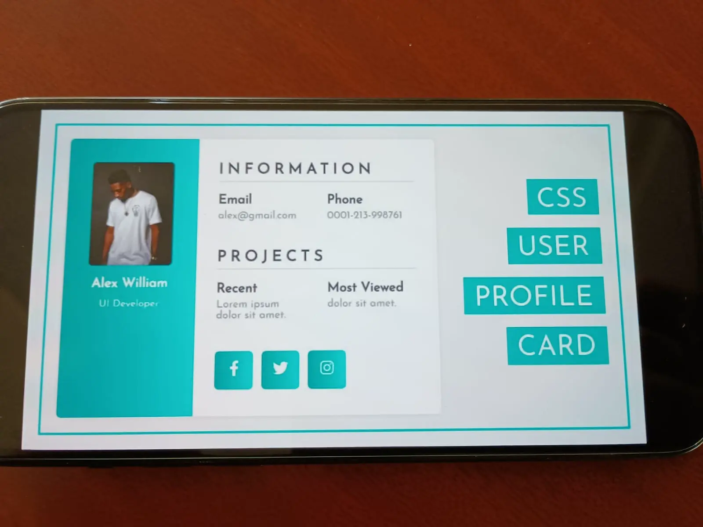

# 🧑‍💻 CSS User Profile Card

This project is a simple and modern **User Profile Card** built using only HTML and CSS. It is a responsive layout designed to practice and demonstrate key front-end skills like Flexbox, positioning, typography, and layout structure.

---

## 💡 Features

- Clean UI design
- Left-aligned profile with user image, name, and role
- Right-aligned info card with:
  - Contact information (email, phone)
  - Project info (recent, most viewed)
  - Social media buttons
- Vertical label buttons: `CSS`, `USER`, `PROFILE`, `CARD`

---

## 🔧 Built With

- HTML5
- CSS3 (Flexbox)

---